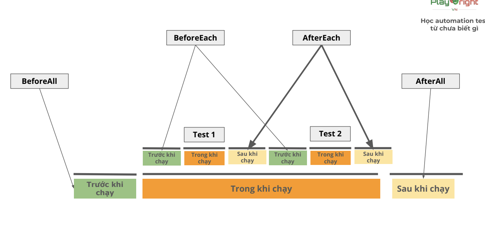

# Playwright

## Test describe

- Test suite: Tập hợp các test case. Giúp nhóm các test lại dễ quản lí hơn

        test.describe('<tên suite>', async () => {
            test('test1', async ({ page }) => {
                // code ...
            });

            test('test 2', async ({ page }) => {
                // code ...
            });
        })

## Test Hooks

- Các thời điểm chạỵ test:
    - Trước khi chạy
    - Trong khi chạy
    - Sau khi chạy

- Playwright
    - Gọi các thời điểm test là Hooks
    - Các Hook:
        - beforeAll
        - beforeEach
        - afterEach
        - afterAll

- Cách thức hoạt động

